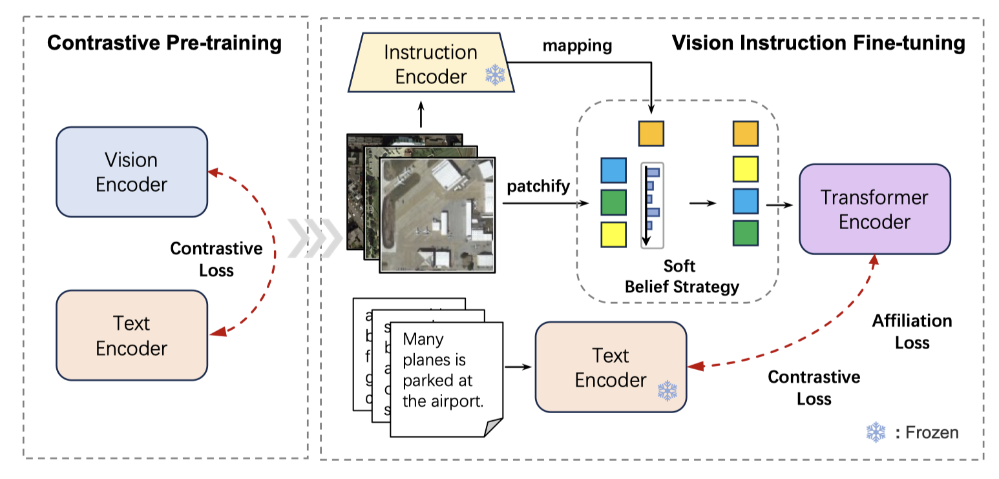

# PIR: Remote Sensing Image-Text Retrieval with Prior Instruction Representation Learning
By [Jiancheng Pan](https://scholar.google.com/citations?user=nRPD3tAAAAAJ&hl=en&oi=ao), [Muyuan Ma](https://scholar.google.com/citations?user=-bc9o9EAAAAJ&hl=en&oi=ao), Qing Ma, [Cong Bai](https://scholar.google.com/citations?hl=zh-CN&user=XGZ4UZgAAAAJ&view_op=list_works&sortby=pubdate), [Shengyong Chen](https://scholar.google.com/citations?user=6nSU254AAAAJ&hl=en).

This repo is the official implementation of "[PIR-CLIP: Remote Sensing Image-Text Retrieval with Prior Instruction Representation Learning](https://arxiv.org/abs/2405.10160)".

- [PIR-CLIP: Remote Sensing Image-Text Retrieval with Prior Instruction Representation Learning](#pir-clip-remote-sensing-image-text-retrieval-with-prior-instruction-representation-learning)
  - [ℹ️ Introduction](#ℹ️-introduction)
  - [🎯 Implementation](#-implementation)
    - [Environments](#environments)
    - [Train](#train)
    - [Retrieval](#retrieval)
  - [🌎 Datasets](#-datasets)
  - [📝 Citation](#-citation)

## ℹ️ Introduction
Remote sensing image-text retrieval constitutes a foundational aspect of remote sensing interpretation tasks, facilitating the alignment of vision and language representations. This paper introduces a prior instruction representation (PIR) learning paradigm that draws on prior knowledge to instruct adaptive learning of vision and text representations. Based on PIR, a domain-adapted remote sensing image-text retrieval framework PIR-ITR is designed to address semantic noise issues in vision-language understanding tasks. However, with massive additional data for pre-training the vision-language foundation model, remote sensing image-text retrieval is further developed into an open-domain retrieval task. Continuing with the above, we propose PIR-CLIP, a domain-specific CLIP-based framework for remote sensing image-text retrieval, to address semantic noise in remote sensing vision-language representations and further improve open-domain retrieval performance. In vision representation, Vision Instruction Representation (VIR) based on Spatial-PAE utilizes the prior-guided knowledge of the remote sensing scene recognition by building a belief matrix to select key features for reducing the impact of semantic noise. In text representation, Language Cycle Attention (LCA) based on Temporal-PAE uses the previous time step to cyclically activate the current time step to enhance text representation capability. A cluster-wise Affiliation Loss (AL) is proposed to constrain the inter-classes and to reduce the semantic confusion zones in the common subspace. Comprehensive experiments demonstrate that PIR could enhance vision and text representations and outperform the state-of-the-art methods of closed-domain and open-domain retrieval on two benchmark datasets, RSICD and RSITMD.


## 🎯 Implementation
### Environments
base on `open_clip` environments, you can click here [open_clip](https://github.com/mlfoundations/open_clip).

### Train
If using Affiliation loss, add `is_aff_loss` where the label information is obtained by `image_name` from datasets. For example, we can train PIR-CLIP using the follow commad:
```
python -m training.main \
    --save-frequency 1 \
    --report-to tensorboard \
    --train-data="path/to/webdataset/tar" \
    --dataset-resampled \
    --train-num-samples num_dataset \
    --dataset-type webdataset \
    --warmup 10000 \
    --batch-size=512\
    --precision amp \
    --lr=1e-5 \
    --wd=0.5 \
    --epochs=20 \
    --workers=4 \
    --model=PIR \
    --is_aff_loss
```
or parallel training as
```
torchrun --nproc_per_node 2 \
    --rdzv_endpoint=$HOSTE_NODE_ADDR \
    -m training.main \
    --save-frequency 1 \
    ...
```
### Retrieval
Retrieval evaluation on [CLIP Benchmark](https://github.com/ChenDelong1999/RemoteCLIP) and checkpoints can download from here: [Baidu Disk](https://pan.baidu.com/s/15KMR8bizO_6eXZHejEiTbQ?pwd=wpef).
```
python retrieval.py \
    --model-name "PIR" \
    --retrieval-images-dir "path/to/images" \
    --retrieval-json-dir "path/to/dataset.json" \
    --remoteclip-path "./checkpoints/PIR-CLIP_RET-3.pt"
```
## 🌎 Datasets

All experiments are based on [RSITMD](https://github.com/xiaoyuan1996/AMFMN/tree/master/RSITMD), [RSICD](https://github.com/201528014227051/RSICD_optimal) datasets and pre-training dataset [RS5M](https://github.com/om-ai-lab/RS5M).

## 📝 Citation

If you find this code useful for your work or use it in your project, please cite our paper as:

```
@inproceedings{pan2023prior,
  title={A Prior Instruction Representation Framework for Remote Sensing Image-text Retrieval},
  author={Pan, Jiancheng and Ma, Qing and Bai, Cong},
  booktitle={Proceedings of the 31st ACM International Conference on Multimedia},
  pages={611--620},
  year={2023}
}

@misc{pan2024pir,
      title={PIR: Remote Sensing Image-Text Retrieval with Prior Instruction Representation Learning}, 
      author={Jiancheng Pan and Muyuan Ma and Qing Ma and Cong Bai and Shengyong Chen},
      year={2024},
      eprint={2405.10160},
      archivePrefix={arXiv},
      primaryClass={cs.CV}
}
  
```
